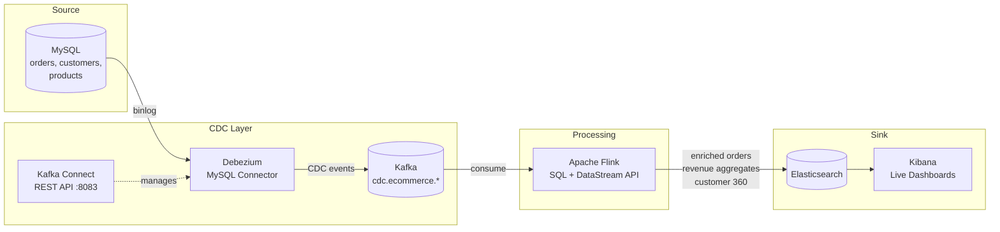

# CDC Data Pipeline: MySQL → Debezium → Kafka → Flink → Elasticsearch

A production-grade **Change Data Capture** pipeline that watches a MySQL database in real time, streams every insert/update/delete into Kafka via **Debezium**, enriches and aggregates the events with **Apache Flink SQL**, and sinks results into **Elasticsearch** for live **Kibana** dashboards.

This repo demonstrates the exact "Kafka Connectors" and Flink streaming expertise listed on my CV, applied to a realistic e-commerce operational intelligence use case.

---

## Architecture



### What the pipeline computes

| Flink Job | Input topics | Output index | Purpose |
|-----------|-------------|--------------|---------|
| `EnrichedOrdersJob` | `cdc.orders` + `cdc.customers` | `enriched-orders` | Join order with customer name/city |
| `RevenueAggregatesJob` | `cdc.orders` | `revenue-5m` | Rolling 5-min revenue per product category |
| `Customer360Job` | `cdc.orders` + `cdc.customers` | `customer-360` | Per-customer spend totals, last-seen |

---

## Quickstart

```bash
make up            # start full stack (~90s)
make connectors    # register the Debezium MySQL connector
make seed          # seed sample e-commerce data (runs continuously)
make jobs          # submit all three Flink SQL jobs
make kibana        # open Kibana at http://localhost:5601
make down
make clean         # remove all volumes
```

### UIs

| Service | URL |
|---------|-----|
| Kafka UI | http://localhost:8080 |
| Flink dashboard | http://localhost:8081 |
| Kafka Connect REST | http://localhost:8083 |
| Elasticsearch | http://localhost:9200 |
| Kibana | http://localhost:5601 |

---

## Project layout

```
.
├── docker-compose.yml
├── Makefile
├── mysql/
│   └── init/           # schema + seed data
├── debezium/
│   └── mysql-connector.json   # Debezium connector config
├── flink-jobs/
│   ├── pom.xml
│   └── src/main/java/com/cdc/
│       ├── EnrichedOrdersJob.java
│       ├── RevenueAggregatesJob.java
│       └── Customer360Job.java
└── kibana/
    └── dashboards/     # exported Kibana dashboard JSON
```

---

## Understanding the CDC event format

Debezium wraps every database change in an envelope with `before` / `after` / `op` fields:

```json
{
  "op":     "c",            // c=create  u=update  d=delete  r=read(snapshot)
  "before": null,           // null for inserts
  "after":  { "id": 1, "customer_id": 42, "amount": 149.99, ... },
  "source": {
    "db":    "ecommerce",
    "table": "orders",
    "ts_ms": 1714000000000
  }
}
```

The Flink jobs extract `payload.after` for inserts/updates and ignore deletes (`op=d`) for the aggregation use case.

---

## Design decisions & trade-offs

### Why Debezium (CDC) instead of application-level events?

| Approach | Pros | Cons |
|---|---|---|
| Application publishes events | Full control, clean schema | Dual-write risk (DB + Kafka can desync), needs code changes |
| Database triggers | No code changes | Slow, imperative, hard to evolve |
| **CDC (Debezium)** | **Zero app changes, captures ALL mutations, exactly matches DB truth** | Needs binlog access, schema evolution overhead |

At ENBD / Credit Suisse, CDC was the only practical option for capturing mutations in third-party systems we couldn't modify.

### Flink SQL vs DataStream API

`RevenueAggregatesJob` uses **Flink SQL** — it's more readable and easier to explain to analytics stakeholders. `EnrichedOrdersJob` uses the **DataStream API** for the streaming join because Flink SQL's temporal join requires a keyed state layout that's harder to reason about here.

### Elasticsearch as the sink

We chose Elasticsearch over Postgres for the sink because:
- Kibana gives instant dashboard capability with no extra work
- ES handles time-series aggregation queries faster than OLTP databases
- Kibana's auto-refresh + scripted fields match BI stakeholder requirements

### Idempotency

Each job uses the Flink `Elasticsearch7SinkFunction` with `UPSERT` mode keyed on the Kafka message key (which Debezium sets to the primary key). This means replaying from an earlier Kafka offset is safe.

---

## Interview talking points

**"How does Debezium handle schema changes in MySQL?"**
Debezium stores the schema history in a dedicated Kafka topic (`schema-changes.ecommerce`). When a column is added, Debezium reads the old schema from history to decode earlier events and the new schema for subsequent ones. For breaking changes (column removal), we'd pause the connector, run the migration, update the connector config, and resume.

**"What happens if the Flink job is down while Kafka keeps receiving events?"**
Kafka retains the data. When the job restarts from its last checkpoint, it resumes from the committed offset. Because Flink checkpoints state atomically with the Kafka offset, the output is exactly-once end-to-end (with the Kafka source + ES UPSERT sink providing the guarantee).

**"How do you monitor Kafka Connect / Debezium in production?"**
- Kafka Connect exposes JMX metrics (connector status, records produced, lag behind binlog).
- We scrape these with a JMX Exporter sidecar into Prometheus and alert on `debezium_connector_status != RUNNING`.
- Consumer group lag for the Flink consumer group is a key SLA metric — alert if lag > 10k events.

**"How do you handle deletes in the CDC stream?"**
For the revenue/customer-360 indices we ignore `op=d` — a deleted order shouldn't reverse past revenue reporting. For an `enriched-orders` index that needs to reflect current state, we'd use the `_delete` Elasticsearch action when `op=d`.

---

## What's next

- [ ] Add Schema Registry + Avro serialisation
- [ ] Add connector status monitoring (Prometheus + Grafana)
- [ ] Add a dead-letter topic for malformed events
- [ ] Add OpenShift manifests (Flink Operator + Kafka Connect Operator)

---

## License
MIT
